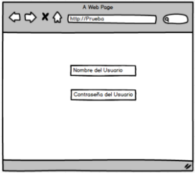
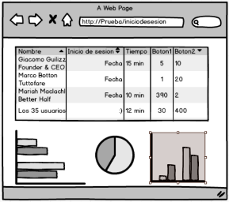
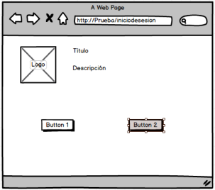

<h2 align="center">
    
Prueba Tecnica Full Stack Developer

    
Junior

</h2>

    
    
    
    
    

### Descripción

Crear una aplicación utilizando Django y React. La aplicación es la interfaz de una consola de administración donde un usuario tiene acceso de administrador y los 35 usuarios tienen acceso como usuarios regulares. Los usuarios para ingresar a la aplicación tienen que poner su usuario y contraseña. Si el usuario administrador ingresa, la aplicación mostrará la consola de administración y analiticos sobre los 35 usuarios. Quienes iniciaron sesión, por cuanto tiempo y si hicieron clic a dos botones que están en la landing page de los usuarios. Si un usuario regular ingresa, la aplicación mostrará una landing page con un título, logo, una breve descripción y dos botones. Los botones actúan como contadores y se va almacenando un registro de cuando los usuarios ingresan a la aplicación y presionan los botones.

## Actividad 1 - Django

Crear el backend de una aplicación en Django. La aplicación va a tener el siguiente alcance.

- Tiene un usuario admin con contraseña
- Tiene 35 usuarios regulares con contraseñas
- Almacena cuando un usuario ingresa, cuánto tiempo dura conectado y cuando le da clic a los botones de la landing page.
- Guarda la imagen, logo y descripción de la landing page.
- El backend se conectará al frontend en react.

## Actividad 2 - React

Crear el front end con React que se conecte al backend de Django. Se puede usar el framework de `Ant Design` o el que sea de su preferencia. La página de inicio es para ingresar a la aplicación, para usuarios regulares o para usuario admin.

    

Después de ingresar el usuario y la contraseña, el Usuario Admin va a ver la siguiente página o consola de administración. Está la lista de los 35 usuarios y la información de fecha de inicio de sesión, tiempo de sesión y si le dieron clic al botón 1 y al botón 2. Los botones funcionan como contadores. También hay gráficas de las tablas.

    

Si ingresa un Usuario regular, la aplicación va a mostrar una landing page con un logo, título y descripción de la aplicación. En la parte inferior están los dos botones los cuales puede presionar las veces que quiera.

    

## Actividad 3 - Documentación

Se tiene que entregar el código con una documentación sencilla en un repositorio privado de Github. Donde se pueda correr y probar.
